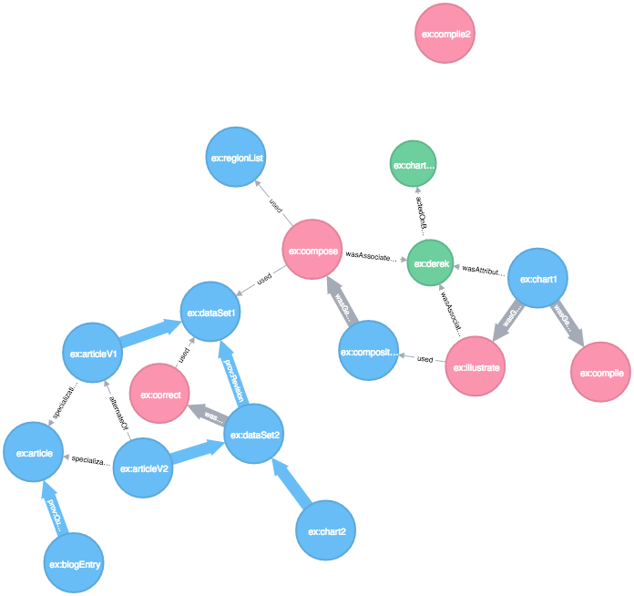

.. provneo4j-api documentation master file, created by
   sphinx-quickstart on Sun Jul 20 12:50:01 2014.
   You can adapt this file completely to your liking, but it should at least
   contain the root `toctree` directive.

provneo4j
==========================================

provneo4j is a Python client for storing `PROV <https://www.w3.org/TR/2013/NOTE-prov-overview-20130430/>`_ 
documents in `Neo4j <https://neo4j.com/>`_.

This library used the Python library `prov <https://github.com/trungdong/prov>`_.

Installation
------------

Install by running::

    pip install provneo4j

Usage
-----

Import the API and connect to the Neo4j database::

    import provneo4j.api
    provneo4j_api = provneo4j.api.Api(base_url="http://localhost:7474/db/data", username="neo4j", password="neo4j")

Import the `prov <https://github.com/trungdong/prov>`_ library and generate a PROV document. As an example, you can just use the `primer example <https://github.com/trungdong/prov/blob/master/prov/tests/examples.py>`_::

    from prov.model import ProvDocument, Namespace, Literal, PROV, Identifier
    import datetime

    prov_document = primer_example()

Now store the PROV document in Neo4j::

    provneo4j_api.document.create(prov_document, name="Primer Example")

The result in Neo4j looks like this:

   Primer example in Neo4j.

Unsupported features and known issues
-------------------------------------

- Authentication: The library only support the authentication with username / password. No public access
- `Primer_example <https://github.com/DLR-SC/provneo4j-api/issues/2>`_: The test for the primer_example from the prov library fails on the first run
- Public access: The library don't support the public / private access flag

Contribute
----------

- Issue Tracker: `GitHub issues <https://github.com/DLR-SC/provneo4j/issues>`_.
- Source Code: `GitHub <https://github.com/DLR-SC/provneo4j>`_.

API Documentation
-----------------

.. toctree::
   :maxdepth: 2

   provstore

Indices and tables
------------------

* :ref:`genindex`
* :ref:`modindex`
* :ref:`search`
